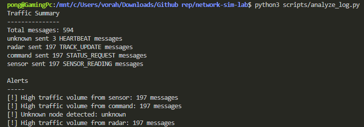
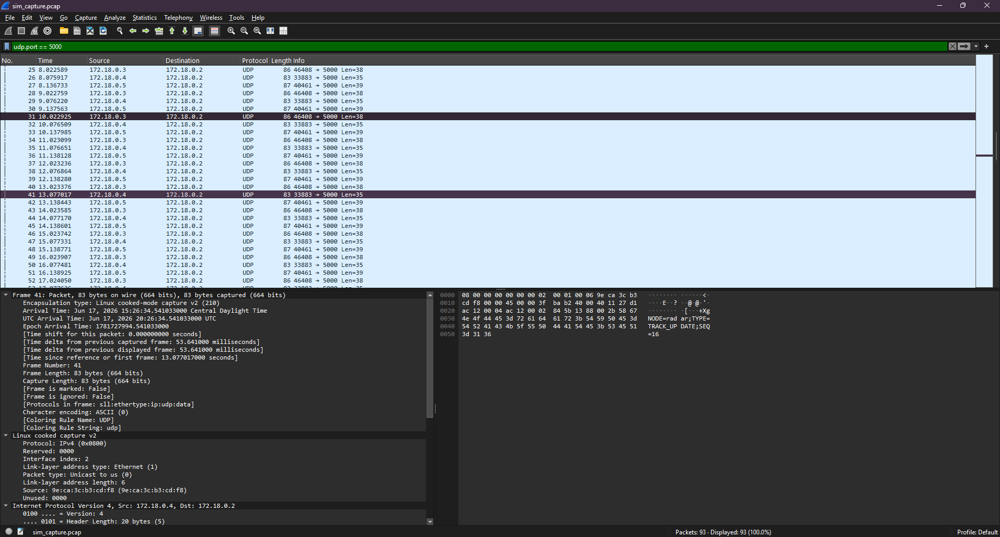

# C++ Network Simulation & Traffic Analysis Lab

A local network simulation project built to practice C++ socket programming, Linux networking, Docker, packet capture, and defensive traffic analysis.

The project simulates multiple network nodes sending structured UDP messages to a central monitoring process. The monitor logs traffic, and a Python analyzer summarizes the messages and detects abnormal patterns such as unknown nodes, missing expected nodes, and high message volume.

## Technologies Used

- C++17
- Python
- CMake
- Linux / WSL Ubuntu
- UDP sockets
- Docker / Docker Compose
- tcpdump
- Wireshark

## Project Architecture

```text
radar node   ----\
                  \
command node -----> monitor node ---> logs/sim.log ---> Python analyzer
                  /
sensor node  ----/
```

## Features

* Built a UDP-based network simulation using C++.
* Simulated multiple nodes: radar, command, and sensor.
* Added node-specific message types.
* Logged received network messages to a file.
* Built a Python traffic analyzer.
* Detected abnormal traffic patterns:
    - unknown nodes
    - unknown message types
    - missing expected nodes
    - high message volume
* Dockerized the simulation using Docker Compose.
* Captured traffic using tcpdump.
* Inspected packets in Wireshark.

## How to Build Locally
```
cmake -S . -B build
cmake --build build
```

## How to Run Locally
Start the receiver:
```
./build/sim_node receiver 5000
```
Start senders in seperate terminals:
```
./build/sim_node sender radar 127.0.0.1 5000
./build/sim_node sender command 127.0.0.1 5000
./build/sim_node sender sensor 127.0.0.1 5000
```

## How to Run with Docker
```
docker compose up --build
```
Stop the contianers:
```
docker compose down
```

## How to Analyze Logs
```
python3 scripts/analyze_log.py
```
Example output:
```
Traffic Summary
---------------
Total messages: 30
radar sent 10 TRACK_UPDATE messages
command sent 10 STATUS_REQUEST messages
sensor sent 10 SENSOR_READING messages

Alerts
------
No alerts detected.
```

## How to Capture Traffic
Run the simulation first with ```docker compose up --build```
Then capture the traffic from the monitor container with:
```
mkdir -p captures

docker run --rm -it \
  --network container:network-sim-lab-monitor-1 \
  --cap-add NET_ADMIN \
  --cap-add NET_RAW \
  -v "$PWD/captures:/captures" \
  nicolaka/netshoot \
  tcpdump -i any -s 65535 udp port 5000 -w /captures/sim_capture.pcap
```
Then open the capture from app/captures with Wireshark and filer with ```udp.port == 5000```

## Screenshots
### Python Analyzer

### Wireshark


## What I learned
* How UDP sockets work in C++.
* How to send and receive structured messages between processes.
* How to use CMake to build a C++ project.
* How Docker Compose can simulate multiple networked services.
* How to capture and inspect UDP traffic with tcpdump and Wireshark.
* How to build a basic Python traffic analyzer for defensive monitoring.